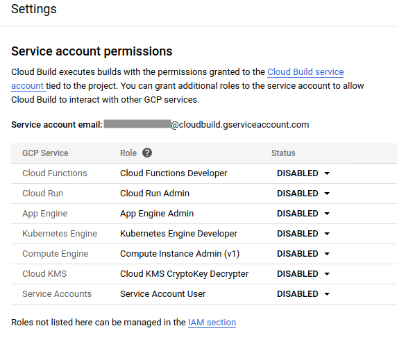
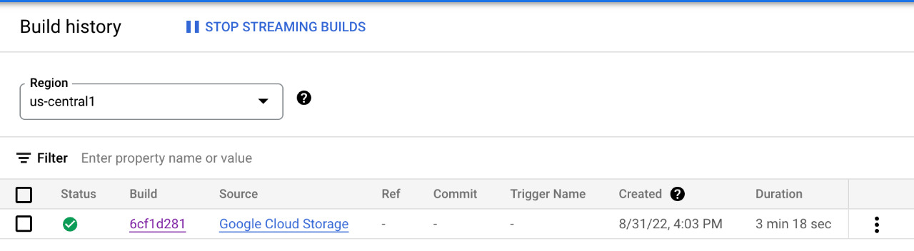
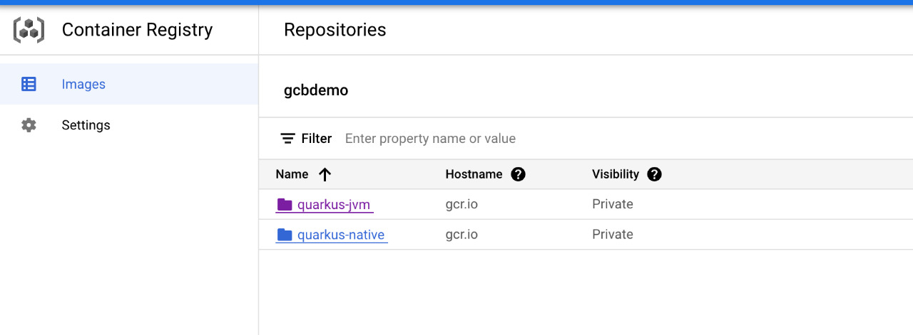

# CI/CD Using Google Cloud Build and Google Cloud Run.

This project uses Quarkus, the Supersonic Subatomic Java Framework.

If you want to learn more about Quarkus, please visit its website: https://quarkus.io/ .

Also uses Apache Camel ™ a versatile open-source integration framework based on known Enterprise Integration Patterns.

If you want to learn more about Apache Camel on Quarkus, please visit its website: https://camel.apache.org/camel-quarkus .

## Objectives
* Write, build and deploy a Camel Quarkus service (Native and Java) to Cloud Run using Cloud Build

## Before you begin
### Setting up gcloud defaults
* Set your default project.
```shell script
gcloud config set project PROJECT_ID
```
Replace **PROJECT_ID** with the name of the project you created  for this example.

* Configure gcloud for your chosen region
```shell script
gcloud config set run/region REGION
```
Replace **REGION** with the region of your choice.

* Enable the Cloud API neccessary to run this example
```shell script
gcloud services enable run.googleapis.com \
containerregistry.googleapis.com cloudbuild.googleapis.com
```
This command enables the following APIs:
* Cloud Run API
* Container Registry API
* Cloud Build API

## Allow permission to execute build and run commands
* Allocate an IP Addresses range and create a private connection to configure private services access for Cloud SQL
You can grant certain commonly used IAM roles to the Cloud Build service account using the Cloud Build Settings page in the Google Cloud console:
* Open the [Cloud Build settings Page](https://console.cloud.google.com/cloud-build/settings)
You'll see the **Service Account Permissions** page:


* Set the status of the roles **Cloud Run** to **Enable**

## Run Cloud Build Pipeline
### Create Quarkus Native Service
Quarkus allows you to create native binary using GraalVM (https://quarkus.io/guides/building-native-image).

Inside Folder [.cloudbuild](https://github.com/mikeintoch/gcp-quarkus-samples/tree/main/cloudbuild/run/.cloudbuild) there are scripts to execute our Pipeline

**native-build.yaml**

```shell script
steps:

#Build native quarkus image
- name: 'ghcr.io/graalvm/graalvm-ce:latest'
  entrypoint: bash
  args: ['./.cloudbuild/native-build-script.sh']

#Build docker image
- name: 'gcr.io/cloud-builders/docker'
  args: ['build', '-f', 'src/main/docker/Dockerfile.jvm','-t', 'gcr.io/$PROJECT_ID/$_APP_NAME', '.']

#Push container to container registry
- name: 'gcr.io/cloud-builders/docker'
  args: [ 'push', 'gcr.io/$PROJECT_ID/$_APP_NAME']

#Deploy to cloud run
- name: 'gcr.io/cloud-builders/gcloud'
  args:
   - 'run'
   - 'deploy'
   - '$_APP_NAME'
   - '--image'
   - 'gcr.io/$PROJECT_ID/$_APP_NAME'
   - '--region'
   - '$_GCP_REGION'
   - '--platform'
   - 'managed'

timeout: 3600s
substitutions:
  #Cloud run deploy region
  _GCP_REGION: 'us-central1'
  _APP_NAME: 'quarkus-native'
```

* You can run this pipeline using the below command to perform a build operation which will generate a docker image. It will also perform deploy operations to the cloud run.
```shell script
gcloud builds submit --config .clouduild/native-build.yaml --region us-central1
```

* Verify Cloud Build History
Go to [Cloud Build History](https://console.cloud.google.com/cloud-build/builds;region=us-central1)



* Verify image in Cloud Registry
Go to [Cloud Registry](https://console.cloud.google.com/gcr/images)



## Trying out

* Get URL from you service
```shell script
gcloud run services list
```
from the output copy the information from URL column

* Send a request to your service to get Fruits
```shell script
curl https://YOUR_URL/fruits
```
Replace **YOUR_URL** with your own value.

**Output**
```shell script
[
    {
        "name": "Apple",
        "description": "Winter fruit"
    },
    {
        "name": "Pineapple",
        "description": "Tropical fruit"
    }
]
```
* * Send a request to your service to add a Fruit

```shell script
curl  -X POST https://YOUR_URL/fruits  -H 'Content-Type: application/json' -d '{"name": "Watermelon","description": "Another Tropical fruit"}'
```
Replace **YOUR_URL** with your own value.

**Output**
```shell script
[
    {
        "name": "Apple",
        "description": "Winter fruit"
    },
    {
        "name": "Pineapple",
        "description": "Tropical fruit"
    },
    {
        "name": "Watermelon",
        "description": "Tropical fruit"
    }
]
```

### Create Quarkus Java Service
Quarkus allows you to create native binary using GraalVM (https://quarkus.io/guides/building-native-image).

Inside Folder [.cloudbuild](https://github.com/mikeintoch/gcp-quarkus-samples/tree/main/cloudbuild/run/.cloudbuild) there are scripts to execute our Pipeline

**jvm-build.yaml**

```shell script
steps:

#Build Jar File
- name: 'gcr.io/cloud-builders/mvn'
  args: ['package', '-Dmaven.test.skip=true', '--batch-mode', '--quiet']

#Build docker image
- name: 'gcr.io/cloud-builders/docker'
  args: ['build', '-f', 'src/main/docker/Dockerfile.jvm','-t', 'gcr.io/$PROJECT_ID/$_APP_NAME', '.']

#Push container to container registry
- name: 'gcr.io/cloud-builders/docker'
  args: [ 'push', 'gcr.io/$PROJECT_ID/$_APP_NAME']

#Deploy to cloud run
- name: 'gcr.io/cloud-builders/gcloud'
  args:
   - 'run'
   - 'deploy'
   - '$_APP_NAME'
   - '--image'
   - 'gcr.io/$PROJECT_ID/$_APP_NAME'
   - '--region'
   - '$_GCP_REGION'
   - '--platform'
   - 'managed'

timeout: 3600s
substitutions:
  #Cloud run deploy region
  _GCP_REGION: 'us-central1'
  _APP_NAME: 'quarkus-jvm'

```

* You can run this pipeline using the below command to perform a build operation which will generate a docker image. It will also perform deploy operations to the cloud run.
```shell script
gcloud builds submit --config .clouduild/jvm-build.yaml --region us-central1
```

* Verify Cloud Build History
Go to [Cloud Build History](https://console.cloud.google.com/cloud-build/builds;region=us-central1)


* Verify image in Cloud Registry
Go to [Cloud Registry](https://console.cloud.google.com/gcr/images)


## Trying out

* Get URL from you service
```shell script
gcloud run services list
```
from the output copy the information from URL column

* Send a request to your service to get Fruits
```shell script
curl https://YOUR_URL/fruits
```
Replace **YOUR_URL** with your own value.

**Output**
```shell script
[
    {
        "name": "Apple",
        "description": "Winter fruit"
    },
    {
        "name": "Pineapple",
        "description": "Tropical fruit"
    }
]
```
* * Send a request to your service to add a Fruit

```shell script
curl  -X POST https://YOUR_URL/fruits  -H 'Content-Type: application/json' -d '{"name": "Watermelon","description": "Another Tropical fruit"}'
```
Replace **YOUR_URL** with your own value.

**Output**
```shell script
[
    {
        "name": "Apple",
        "description": "Winter fruit"
    },
    {
        "name": "Pineapple",
        "description": "Tropical fruit"
    },
    {
        "name": "Watermelon",
        "description": "Tropical fruit"
    }
]
```